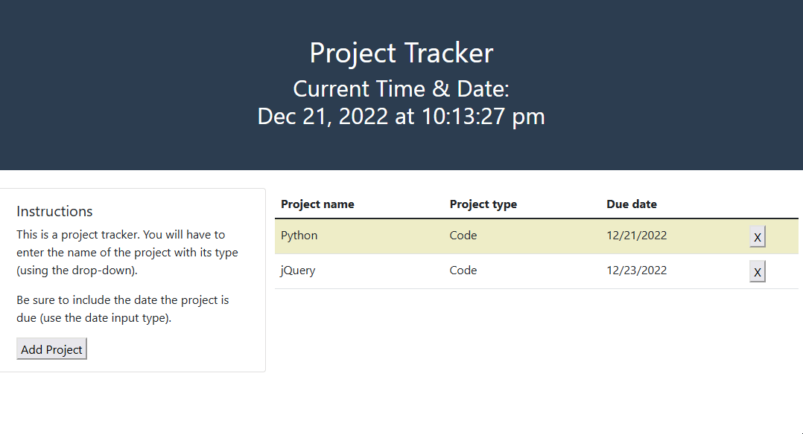

# Project-Tracker

## Description

This program is used to prompt, store, and then display a list of projects. The prompt is presented in a form inside of a bootstrap modal with a jQueryUI widgets used for the date picker. The data is saved into the browser's localStorage and then displayed in a table. Each row in the table has the ability to be deleted from localStorage with a button that has had an event tied to it with jQuery through the use of a delegated event.

This program utilizes different web development aspects such as: jQuery, jQueryUI, dayjs, Bootstrap, modals, delegated events, accessing localStorage, timers, functions, array and object methods, and page events.

## Link

This is a link to the project hosted on GitHub Pages: 

## Usage

This image is an example of what to expect when viewing the complete webpage.

